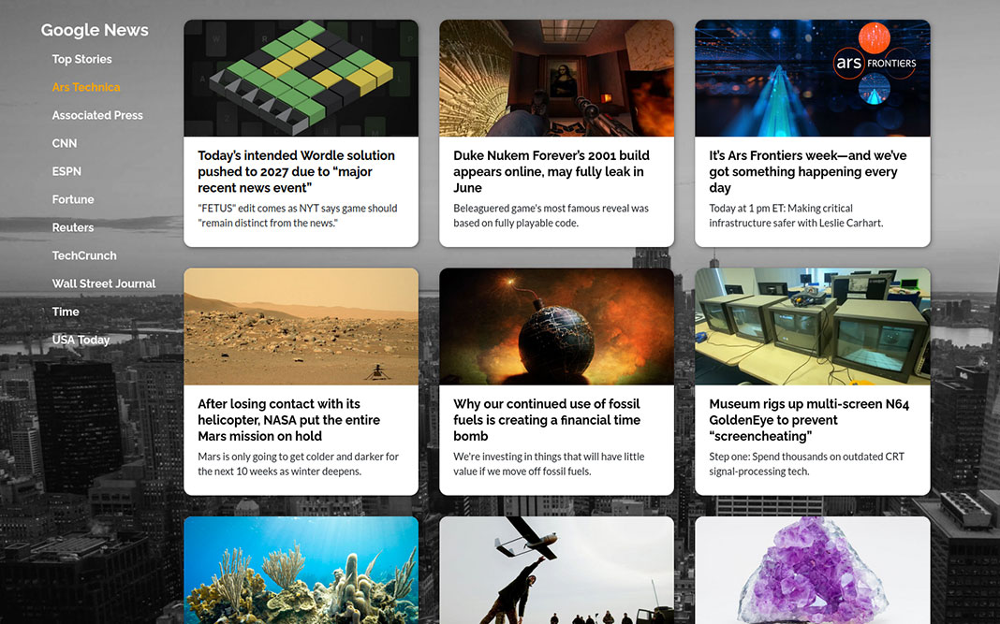

# React Google News

### A simple [React](https://reactjs.org/) front end application using the [Google News API](https://newsapi.org/).
React Google News uses a lightweight Node Express back end to reroute API queries to a React front end. It displays trending articles in a responsive card grid format and allows the user to select from several popular news websites.

## Demo App
You can see a demo version of this application deployed to Heroku here: https://react-google-news.herokuapp.com

## Application Info
The project is configured with [Node Package Manager](https://www.npmjs.com/), [Webpack](https://webpack.js.org/), and [Babel](https://babeljs.io/).

It uses [webpack-merge](https://www.npmjs.com/package/webpack-merge) to separate development and production builds, but keep a common, reusable configuration. It is also configured for hot reloads in the Express server, so Webpack will rebuild when changes are made.

An Express back end is used to make API requests and protect the API key. Routes are configured for a select number of news websites to query articles from. All routes can be found in the [server.js](../master/server.js) file.

The application implements Bootstrap via [Reactstrap](https://reactstrap.github.io/). It makes front end API calls with [fetch](https://github.com/github/fetch).

## Commands

`npm run build` - Use Webpack to build for production.

`npm run start` - Run the Express server via Node.

`npm run dev` - Build for development and run the Express server. Code changes will be implemented automatically through hot reloading.

## Install Instructions
Node Package Manager (NPM) is used for dependencies. To install the application locally, follow these instructions:

1. Install [Node.js](https://nodejs.org/). NPM comes packaged with it.
2. Run `npm install` in the command line while in the project directory. It will install dependencies from the [package.json file](../master/package.json).
3. To build for development and run the local dev server at http://localhost:5000, run `npm run dev`. It will run the Node/Express application in the [server.js file](../master/server.js).

In order to access the News API, you must go to the API website and sign up for an account [here](https://newsapi.org/). Once you have an API key, configure it locally with [dotenv](https://www.npmjs.com/package/dotenv). Create a .env file and set `API_KEY="insert API key here"`. For production, set an environment variable manually through command line: `NODE_ENV=production, API_KEY=...`.

## License
This project is open source under the terms of the [MIT License](http://opensource.org/licenses/MIT).
